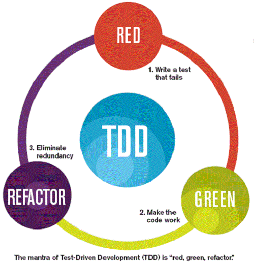

# 常見測試理論

### DDD

領域驅動設計（domain-driven design）是軟體程式碼的結構及語言（類別名稱、類別方法、類別變數）需符合業務領域中的習慣用法。

領域驅動設計的前提是：

* 把專案的主要重點放在核心領域（core domain）和領域邏輯&#x20;
* 以領域中的模型為基礎，進行複雜的設計&#x20;
* 讓技術人員以及領域專家合作，以迭代方式來完善特定領域問題的概念模型

DDD 的核心在於技術人員與專業人員進行商業、系統、使用者流程的分析，而不是單純技術面上的分析。

在經過這個分析和設計之後，理想狀況是團隊可以用一樣詞彙<mark style="color:red;">**(Ubiquitous Language)**</mark>來溝通，系統和團隊間應該有清楚的界線；而且每一個商業流程圖都可以在資訊系統內找到相對應的功能和清楚的對應關係。

DDD的入門最初是先建立Ubiquitous Language，也就是通用語言，讓開發者、專業人員、需求者、業務...等等系統相關人員都能參與系統設計與商業邏輯討論，再來是限縮領域範圍，找出當前最需解決的問題，並試圖定義模組邊界，降低個別模組的耦合性。

### BDD

行為驅動開發（Behavior-driven development）是一種敏捷軟體開發的技術，它鼓勵軟體項目中的開發者、QA和非技術人員或商業參與者之間的協作。

BDD的重點是通過與利益相關者的討論取得對預期的軟體行為的清醒認識。它通過用自然語言書寫非程式設計師可讀的測試用例擴展了測試驅動開發方法。行為驅動開發人員使用混合了領域中統一的語言的母語語言來描述他們的代碼的目的。這讓開發者得以把精力集中在代碼應該怎麼寫，而不是技術細節上，而且也最大程度的減少了將代碼編寫者的技術語言與商業客戶、用戶、利益相關者、專案管理者等的領域語言之間來回翻譯的代價。

BDD的做法包括：

* 確立不同利益相關者要實現的遠景目標
* 使用特性注入方法繪製出達到這些目標所需要的特性
* 通過由外及內的軟體開發方法，把涉及到的利益相關者融入到實現的過程中
* 使用例子來描述應用程式的行為或代碼的每個單元
* 通過自動運行這些例子，提供快速反饋，進行回歸測試
* 使用「應當(should)」來描述軟體的行為，以幫助闡明代碼的職責，以及回答對該軟體的功能性的質疑
* 使用「確保(ensure)」來描述軟體的職責，以把代碼本身的效用與其他單元(element)代碼帶來的邊際效用中區分出來。
* 使用mock作為還未編寫的相關代碼模塊的替身

BDD工具：Cucumber，此工具是用來描述使用者行為，將其轉換成測試程式碼的工具，有多種程式語言支援此工具，範例如下：

<figure><figcaption></figcaption></figure>

非技術人員可使用自然語言進行撰寫，而Cucumber工具可將此案例「翻譯」成所需要的程式語言，如：Java、C#、python...等等，透過工具就能讓非技術人員參與制定測試計畫。

### TDD

測試驅動開發（Test-driven development）是一種軟體開發過程中的應用方法，倡導先寫測試程序，然後編碼實現其功能得名。

測試驅動開發是戴兩頂帽子思考的開發方式：先戴上實現功能的帽子，在測試的輔助下，快速實現其功能；再戴上重構的帽子，在測試的保護下，通過去除冗餘的代碼，提高代碼品質。測試驅動著整個開發過程：首先，驅動代碼的設計和功能的實現；其後，驅動代碼的再設計和重構。

<figure><figcaption></figcaption></figure>

優點：

* 提高代碼質量：TDD鼓勵編寫清晰、可維護和有較少bug的代碼。因為代碼是為了通過預先定義好的測試而編寫的，因此更有可能覆蓋各種邊緣情況，從而減少程序中的缺陷。
* 促進設計的改進：在編寫實際代碼之前，開發者需要思考如何測試該代碼，這常常導致更好的設計決策和更簡潔的代碼實現。
* 增強開發者信心：通過持續運行測試，開發者可以立即知道他們的最新改動是否破壞了已有的功能，從而更自信地進行大膽的改動和重構。
* 促進持續集成和持續部署：TDD與持續集成（CI）和持續部署（CD）相結合時，可以保證代碼變更後系統的穩定性，減少部署到生產環境的風險。

缺點：

* 學習曲線：對於新手開發者來說，TDD的學習曲線較陡峭。正確地編寫測試以及了解何時重構需要時間和實踐來掌握。&#x20;
* 初期開發速度放緩：儘管長遠來看TDD能夠提高開發效率，減少維護成本，但在項目初期，編寫測試會增加額外的工作量，從而可能導致開發進度變慢。
* &#x20;可能的過度設計：有時候，為了使代碼更容易被測試，開發者可能會過度設計系統，引入不必要的複雜性和抽象，這可能會導致代碼難以理解和維護。&#x20;
* 測試覆蓋的盲點：依賴TDD可能會給開發者一種錯覺，認為所有的測試用例都被覆蓋了。然而，總是存在無法通過測試預測的場景，這可能導致過分自信而忽略了一些潛在的缺陷。
* 除了技術人員外，其餘專案相關人員無法介入討論測試。

### ATDD

驗收測試驅動開發（Acceptance test-driven development）是建立於TDD之上的開發方式，由專案相關人員（PM、企劃、客戶、技術人員...等等）先界定驗收標準以及驗收測試案例後，再使用TDD進行專案開發，過程中有助於讓技術人員了解商業邏輯、客戶實際需求，同時也能讓客戶使用領域語言進行交流，達到通用語言的目的。
